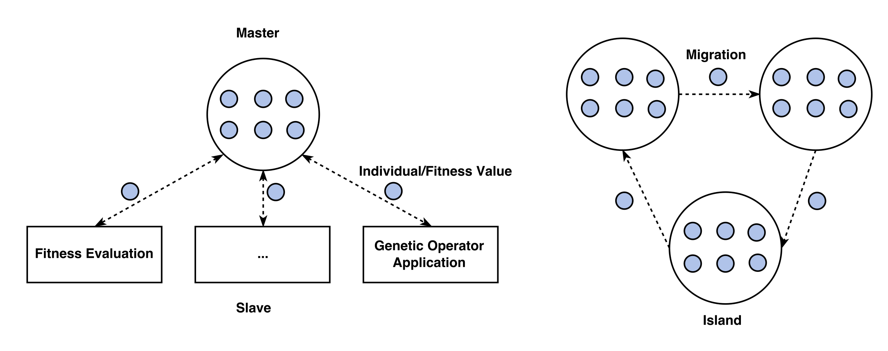

Evolution Models
****************

Once an environment has been defined for the problem to be solved, the next step is to set up an evolutionary model using that environment.

Overview
========

An ``EvolutionModel`` describes the way that the modules provided to the environment are used to evolve a *solution* to the problem.

All this really means is that an evolution model is an implementation of some evolutionary algorithm (EA) that produces solutions --- such as a steady-state or generational algorithm.

The system allows custom models to be created so that the evolution process can be adapted and tuned to the problem being solved. In general, the models provided by the ``Models`` module will provide good performance, as the parameters offer a high degree of adjustment through the environment being used.

To use an EA is as simple as providing the model with an environment and training on a data set for the particular problem being solved. Once the EA has been trained, it can be tested on an arbitrary data set in order to form a prediction.

.. note:: It must be ensured that the environment built provides all the components that the evolution model requires. Because the model has complete access to the environment, it can make use of any component the environment is aware of.

Generally, the model will work by using an evolutionary algorithm to train a population of individuals. The best individual from training will be used by the model to form predictions when testing using the model.

It is possible to use a model directly to solve a problem, but in general it is better to define a ``Problem`` as described in the :doc:`next section<problem>`.

Provided Models
===============

The system offers three built-in EAs which can be used to solve problems without the need to define custom logic. The three models --- ``SteadyState``, ``MasterSlave``, and ``IslandMigration`` --- are contained in the ``Models`` module.

The ``SteadyState`` model is the most basic algorithm and offers fairly conservative performance.

Building upon the ``SteadyState`` algorithm, the ``MasterSlave`` EA adds parallel processing to the base algorithm in an attempt to improve runtime performance. Generally, the ``MasterSlave`` EA will provide better average runtime performance, but will not have any effect on the quality of the solutions.

The ``IslandMigration`` technique is designed to alleviate issues with limited diversity that can arise as the EA is executed. The population of solutions is split across multiple islands, and solutions are exchanged between islands at a regular interval. Problems that suffer from early convergence on local optima can benefit from the increased diversity the ``IslandMigration`` EA gives.

.. note:: For those interested in a detailed comparison of the performance characteristics of the three techniques, feel free to view the accompanying `thesis <http://www.jedsimson.co.nz/static/assets/thesis/Open-Source%20Linear%20Genetic%20Programming.pdf>`_ *(page 56)*.

Example
-------

An environment provides a context for evolution, and we can build a model within that environment easily:

.. code-block:: kotlin

    // The environment from the previous section
    // without any of the registered dependencies.
    val env = Environment<Double, Outputs.Single<Double>>(
        configLoader,
        constantLoader,
        operationLoader,
        defaultValueProvider,
        fitnessFunctionProvider = { ce }
    )

    // Register the modules that are needed to use
    // the model we wish to use (i.e. every core module type).
    val container = ModuleContainer(
        modules = mutableMapOf(
            // Any modules the system needs, as determined by the model
            ...
        )
    )

    environment.registerModules(container)

    // Build a steady-state EA around this environment.
    val model = Models.SteadyState(environment)

    // Define a data set to be used for training. What this data
    // set contains will depend on the problem.
    val trainingDatasetLoader = DatasetLoader<Double> {
        // Could be loaded from a file or built directly.
        ...
    }

    // Train the model on the training data set.
    val result = model.train(trainingDatasetLoader.load())

    // Output the fitness of the best individual from training.
    println(result.best.fitness)

    // To perform a prediction using the trained model is easy:
    // Define a data set to be used for testing. This data set
    // will generally be different to that used for training in order
    // to evaluate the solutions generalisation.
    val testDatasetLoader = DatasetLoader<Double> {
        ...
    }

    // Gather the models predictions for this data set.
    val predictions = model.test(testDatasetLoader.load())

API
===

See `nz.co.jedsimson.lgp.core.evolution.model. <https://lgp.jedsimson.co.nz/api/html/nz.co.jedsimson.lgp.core.evolution.model/index.html>`_
