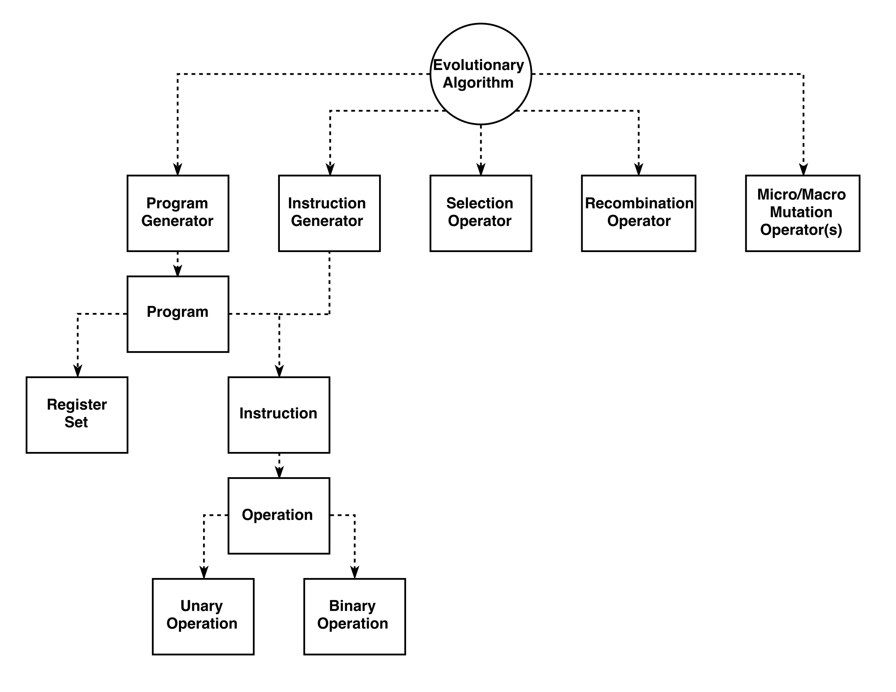

Modules
*******

To make the LGP system malleable to different problem domains, it is designed with the concept of modules. Modules represent a core piece of functionality that the system can use to perform the various operations it needs to.

Any part of the system that is modular can be extended and custom implementations can be provided, as long as the system is made aware of these modules in some way.

There are some restrictions on how modules can be used and what parts of the system are modules, and the following sections of the guide will detail the operation of the different modules the system uses. Note that the evolutionary algorithm is a module, but as it has been previously described it will be omitted in the subsequent sections.

.. toctree::
   :maxdepth: 1
   :caption: Modules:

   operations
   instructions
   programs
   evolutionary-operators
   fitness
   extensions

