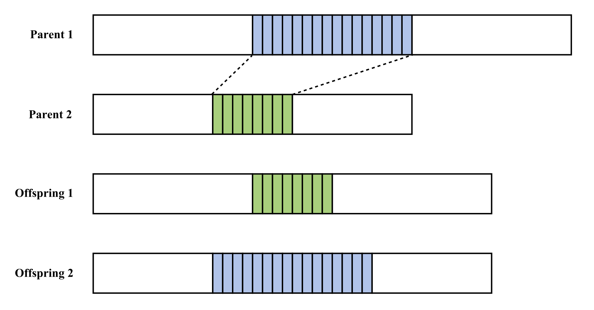

Evolution
*********

Evolutionary Algorithm
======================

In LGP (and other GP techniques) there are three main phases to the evolutionary algorithm -- *Initialisation*, *Selection*, *Variation*.

Usually LGP uses **Algorithm 1**, which is taken from (Brameier, M., Banzhaf, W. 2007). Our system provides an implementation of this algorithm, but also allows for other evolutionary models to be used to allow extension of the core LGP principles.

.. topic:: Algorithm 1 (LGP algorithm)

    1. Initialize a population of random programs.
    2. Randomly select 2 × n individuals from the population without replacement.
    3. Perform two fitness tournaments of size n.
    4. Make temporary copies of the two tournament winners.
    5. Modify the two winners by one or more variation operators for certain probabilities.
    6. Evaluate the fitness of the two offspring.
    7. If the currently best-fit individual is replaced by one of the offspring validate the new best program using unknown data.
    8. Reproduce the two tournament winners within the population for a certain probability or under a certain condition by replacing the two tournament losers with the temporary copies of the winners.
    9. Repeat steps 2. to 8. until the maximum number of generations is reached.
    10. Test the program with minimum validation error again.
    11. Both the best program during training and the best program during validation define the output of the algorithm.

The main phases of the evolutionary algorithm as used by LGP will be described to allow for an understanding so that custom models can be used.

Initialisation
==============

The evolutionary algorithms first phase is to build an initial population of individuals, which is generally done by randomly creating valid LGP programs.

LGP defines an upper and lower bound on the *initial program length*, so that the length of programs created is a randomly chosen from within these bounds with a uniform probability.

It is important to find a balance between too short and too long initial programs, as short initial programs can cause an insufficient diversity of genetic material. Comparatively, initial programs that are too long may reduce their variability significantly in the course of the evolutionary process.

Selection
=========

Selection refers to the process of choosing individuals from a population to be used in the next population after they undergo *variation*.

Generally, the selection method used should be a function of the fitness of each individual so that the population maintains some amount of fit and unfit individuals, in order to increase the diversity of the population.

Some popular selection methods are `Tournament Selection <https://en.wikipedia.org/wiki/Tournament_selection>`_, `Fitness Proportionate Selection <https://en.wikipedia.org/wiki/Fitness_proportionate_selection>`_, and `Reward Based Selection <https://en.wikipedia.org/wiki/Reward-based_selection>`_.

Variation
=========

*Genetic Operators* alter the programs in an LGP population in some way, usually by either adding, removing or exchanging instruction(s), or altering the effect an instruction has -- so called macro and micro mutations respectively.

Macro Operations
----------------

Macro operations are generally used for *recombination* and *mutation* of individuals and operate at the instruction level (i.e. they treat instructions as atomic units and don't modify them directly).

*Recombination* involves a way of combining two individuals from a population, usually using some form of crossover. This has the effect of altering the two individuals length through sharing of genetic material (i.e. the segments of instructions that are exchanged). The operation of linear two-point crossover is illustrated below in the context of two LGP programs:

*Mutation* involves a way of altering a single individual and either increasing or decreasing the length of the program. This is usually done by adding/removing one or more instruction(s) from the program.

Micro Operations
----------------

Micro mutations are performed below the instruction level and consist of ways to:

- Change an instruction's operation.
- Change a register used by an instruction.
- Change a constant value used by an instruction.
