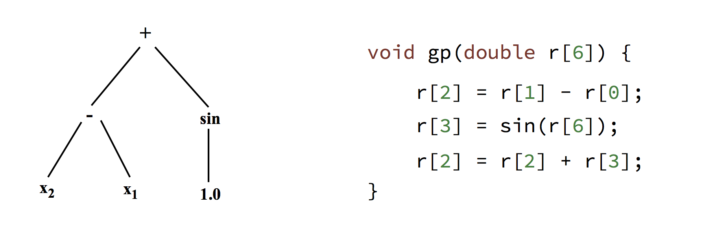
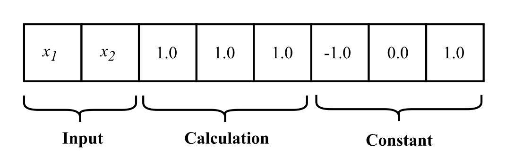

Representation
**************

Programs
========

Linear Genetic Programming (LGP) operates with imperative programs that consist of a variable-length *sequence of instructions* that operate on and manipulate the contents of a *set of registers*.

This is significantly different to other Genetic Programming approaches, such as tree-based GP, which represents programs as a tree where the interior nodes perform operations on the values stored in the leaf nodes. The figure below illustrates the difference between a tree-based GP program and an LGP program.

In this example, the registers contain the values :math:`\{x1, x2, 1.0, 1.0, -1.0, 0.0, 1.0\}` which map directly to the zero-index based registers. The LGP program's output is taken from ``r[2]`` making the two program's outputs equivalent (i.e. the function :math:`f(x_1, x_2) = (x_2 - x_1) + sin(1.0)`).

In essence, an instruction in an LGP program performs an *operation* on a set of *operand (source) registers* and assigns the result of that operation to a *destination register*.

Generally, instructions operate on one or two registers, but our LGP system provides the ability to define instructions that operate on any number of operand registers.

.. note:: A higher number of operands/operators does not necessarily mean that better programs will be produced, as these instructions would represent more complex expressions that are less able to be manipulated by genetic operations during the evolution process.

Registers
=========

In LGP a number of variable registers, the *register set* are provided to each program. The register set is split into three sections that represent the three different types of registers that are used by a program:

**Input Registers**
    Hold program inputs before execution. Generally these will be loaded from a fitness case that the program is being evaluated on.

**Calculation Registers**
    A variable number of additional registers used to facilitate calculations. These registers should be loaded with some constant value before each time a program is evaluated.

**Constant Registers**
    A number of registers which are loaded with a constant value and are write-protected, so that they are always available to an LGP program.

One or more of the input or calculation registers are defined as *output register(s)*. This provides another benefit over Tree-Based GP as the imperative structure allows the use of multiple program outputs.

Instruction Set
===============

The *instruction set* given to an LGP system defines the programming for programs that are evolved within that system.

Generally, an instruction set would include instructions for Arithmetic, Exponential, Trigonometric, and Boolean operations but it is possible in our system to define instructions as necessary for the problem domain (for example, vector operations).

With a certain probability, an instruction can have a constant register as one of its operands, indicating the application of that instructions operation to a constant value.

When using Genetic Programming, there are two invariants of the programs that need to be maintained -- *syntactic correctness* and *semantic correctness*.

**Syntactic Correctness**
    It must be ensured that when modifying a program or combining two programs, that the operation creates a valid program. In LGP, this is done by ensuring that combination does not combine parts of instructions, they are treated as atomic. Furthermore, mutation can only change certain parts of instructions, for example, an instructions operation cannot be changed to a register.

**Semantic Correctness**
    Some operations have undefined behaviour for certain inputs, and this needs to be addressed to ensure programs are valid when executed. This is generally done by creating *protected* versions of operations that have undefined behaviour, which give a high constant value when used on invalid input ranges. This has the effect of penalising programs which use these instructions.

In our implementation, because it is possible to define instructions as needed, this allows for instructions that introduce *side-effects* to some environment the problem is contained within -- for example, a problem that involves moving some agent through a space.

The ability for LGP to find a solution is dependent upon the expressiveness of the instruction set used -- however, the dimension of the search space increases exponentially with the number of instructions available to an LGP program.

Control Flow
============

Branching
---------

Branching is an important concept in programming languages, and it is similarly powerful in the context of Genetic Programming.

Programs in LGP have a linear control flow and a data flow which is representable as a directed graph. Using conditional branches, the linear control flow can be different for various input situations, which can have an effect on the inherit graph created from the data flow.

In LGP (and in this implementation), conditional branches are evaluated such that the instruction following the branch is executed only if the branch is true. That is to say, if the branch is false then a *single* instruction will be skipped.

The logical AND connection between two branches can be created with two branches directly next to each other in the programs sequence:

.. code-block:: c

    if (<cond1>)
    if (<cond2>)
        <oper>

That is, ``<oper>`` will only be reached when both ``<cond1>`` **AND** ``<cond2>`` evaluate to a logically true value.

The logical OR connection can be represented in a similar way:

.. code-block:: c

    if (<cond1>)
        <oper>
    if (<cond2>)
        <oper>

In this case, ``<oper>`` will be evaluated either when ``<cond1>`` **OR** ``<cond2>`` evaluates to a logically true value.

These fairly basic concepts facilitate a basic branching architecture, but to allow for more complicated control flows more advanced concepts are needed.

Some examples of more advanced branching concepts and how they are realised in LGP can be found in the following:

**Nested Blocks**

.. code-block:: c

    if (<cond1>)
        <...>
    endif

Any instructions between the initial conditional and the `endif` instruction are executed when the condition is true, allowing a nested code block that may care for certain input situations.

**Labeled Blocks**

.. code-block:: c

    if (<cond1>) goto <label X>
    <...>
    <label X>

Similar to a `goto` instruction in the C programming language, this form of branch allows for a chunk of instructions to be skipped depending on the value of the condition.

Iteration
---------

There are two main iteration concepts in LGP - *conditional loops* and *finite loops*.

**Conditional Loops**
    Similar to a ``while`` loop like that in most imperative programming languages (e.g. C, Java), a conditional loop describes a loop that jumps backwards in a program and evaluates a condition to determine whether to stay in the loop. One problem with these kind of loops is that they are prone to becoming infinite in terms of their iterations - which is impossible to detect due to the Halting problem. A solution to this is to limit the number of instructions that can be executed for an LGP program (hence artificially limiting the runtime)

**Finite Loops**
    Similar to a ``for`` loop, a finite loop has a finite number of iterations as described by the instruction itself. This means that the instructions in the loop body will be executed some finite amount of times.

